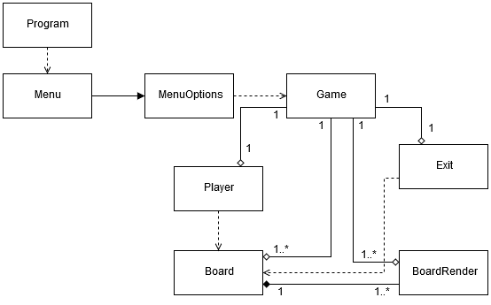

# **RogueProject**

## Credits
* __Catarina Matias__ > __a21801693__ <
 
## Contact
* [GitHub](https://github.com/StarryNight00/ExamePratico2019)

## Who did what
__Catarina Matias__
-> I developed all of the delivered project.

## Our solution
### Project architecture
This project focuses on cycles and cycle control. As it enters the first Menu loop, all screens afterwards are calls on calls to other cycles. Even when a game ends, it calls on another game loop cycle.
Since only the first objective was completed, the only element for the next phase created was an enumeration that would control which tile would be unexplored or not.
The only data structure used were Lists in order to keep track and print each legend to the map. Since the legend didn’t grow much, it wasn't contemplated a situation in which the list would be bigger than the map.
Although at the beginning of the project I didn't have a NumPad, I was able to find a portable one. This helped with the project, but I had to use a day just to restructure the movement cycle.

When entering the first cycle of the Menu, the program travels in between smaller cycles controlled by the MenuOptions class. These cycles initiate and conclude quite fast, except for the 'New Game' option.
The Menu cycle has a condition to end when the '1' option is called, in order to call on the NewGame method from the MenuOptions class. This method initializes all the game needed objects, such as the Board, Player and Exit.
Once inside the Game class, called at 'New Game', the program proceeds to do an infinitude of cycles until the player decides to exit the program.
For each Game there are two "conditions". If the HP of the Player ends, it 'breaks' the cycle, exiting its loop and initializing another. If the 'winCheck' variable becomes true before this 'break' the current cycle ends and starts another too.
In order to work, this program need to have all cycles and variables along the various classes to be perfectly aligned and in accordance, or the cycle either breaks before its time or continuous without an end at sight.

One problem that made necessary to create more cycles than usual was the conversion from the VisualStudio console to the GitBash console. This obligated for every 'ReadLine' or 'ReadKey' to be simply 'Read'. As such, there had to be constant conversions and value checks.
I was able to make it work up until the game loop, where I wasn't able to find a way to convert the 'Read' output into a Key value. I did test the game on the Git CMD console too, in which it functions perfectly - the only set back being that some Unicode symbols won't show.

### UML

Format: 

### Flowchart

Format: 

### Conclusions
__Catarina Matias__ 
-> In this project I believe I developed most of the skills I felt lacking during the duration of the semester. I was able to focus on my logic and coding skills.
-> Unlike during the semester, however, I did not organize myself as much. I lost too much time on a more pressing previous delivery and did not produce as much content to this project. I feel disappointed in myself and unrepresented, but I believe in the quality of what was delivered in the end.
-> Although I was warned to work with a group for this project by the professor, I chose to work alone. To a point, this worked to my advantage, as I was able to focus on my own skills and wasn't worried about someone else's presence or quality of work. Since this was a problem during the semester, I felt that the lack of responsibility over someone else's actions helped me focus and work better.
-> I did enjoy working with my colleagues in the last assignment, and look forward to work with a team in the future. Yet, I did recognize in myself that at the moment I am too stressed and strained from this year's occurrences. Next year I'm sure this feeling will disappear.
-> In the future I would like to continue to improve. I do believe myself capable in this area so far, but I understand myself enough to know I still need to better and push myself a lot more here onwards. 

### References
* Powerpoints provided by the teacher.
* Previous projects with resolutions for small aspects of the program of similar nature.
* C# Microsoft API.
* Online search, but none actually made it into the delivered project since it was either too complex or out of touch with what was asked in this project.